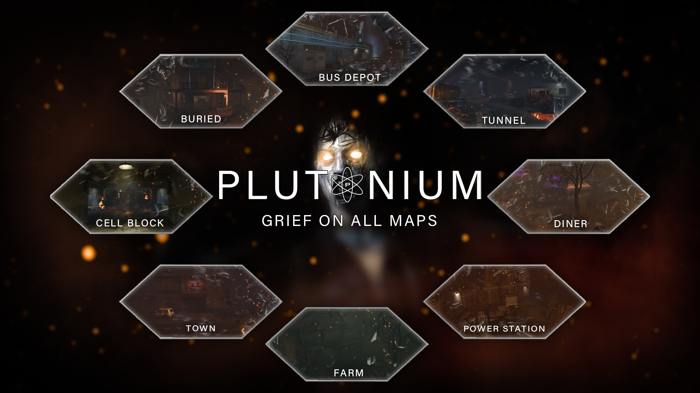

# T6-Plutonium-Grief-Promod
A plutonium mod for the Grief gamemode in zombies. Made for competitive players.

## Created by: JezuzLizard and 5and5

[](https://www.youtube.com/watch?v=vuwAIZxHpWM&ab_channel=Lanevader)

## Change Notes

### General 

- Round scoring - Down all enemy players to score a point for your team, reach the roundlimit to win the match
- Unlimited zombies
- Points awarded for shooting or knifing enemy players

### Game modes

- 4v4
- Free for all

### HUD
- Scoreboard tracks stabs, confirms, revives and downs
- Downed and bled out icons on scoreboard
- Kill feed displayed when hitting a player within 4 seconds of downing
- Custom HUD showing rounds won for each team
- Round number removed

### Game Rules

- `scorelimit` Rounds to win a match (default 3)
- `next_round_time` Seconds till next round starts (default 5)
- `spawn_zombies_wait_time` Seconds till zombies start spawning after round timer (default 5)
- `suicide_check_wait` Seconds players must survive to win a round (default 5)
- `zombie_round` Strength of zombies (default 20)
- `round_restart_points` Points given at the start a round (default 10000)
- `mystery_box_enabled` Toggle is mystery box spawns (default 0)
- `powerups_disabled` Toggle powerups (default 0)
- `buildables` Toggle if buildables are allowed (default 1)
- `player_health` Amount of health players start with (default 100)
- `knife_lunge` Toggle knife lunge (default 0)
- `reduce_mp5_ammo` Toggle if mp5 start without ammo (default 1)
- `reduced_pistol_ammo` toggle if pistol starts with less ammo (default 1)
- `bullet_shellshock_time` Amount of time bullets slow players (default 0.25)
- `fog_disabled` Toggle fog (default 1)
- `visionset_enabled` Toggle enhanced visuals (default 1)

### Restrictions

- `grief_restriction_perks` Restrict certain perks
- `grief_restriction_powerups` Restrict certain powerups
 
## Maps

### Mob of the Dead
- Moved initial spawn points to east cellblock
- Added Jug
- Disabled doors leading to spawn
- Blocked off hallway to spawn

### Buried
- Moved initial spawn points closer to Jug
- Blocked off ways to get to the upper tunnels
- Disabled general store doors

### Tranzit Farm
- Switched Jug and Speed Cola

### Tranzit Town
- No changes made

### Custom Maps
- Tranzit Depot
- Tranzit Power
- Tranzit Tunnel
- Tranzit Diner
- MoTD Docks
- MoTD Citadel
- Die Rise Dragon roof
- Die Rise PDW location
- Nuketown

## Admin Command List
```
/cmdlist [pagenumber]
/rotate
/restart
/randomnextmap
/nextmap <mapalias>
/changemap <mapalias>
/setrotation <rotationdvar>
/resetrotation
/listgamerules
/setgamerule <gamerule> <value> [nummatches]
/resetgamerule <gamerule>
/lock <password>
/unlock
/stats [name|guid|clientnum]
/kick <name|guid|clientnum>
/tempban <name|guid|clientnum> <duration_in_minutes> [reason]
/ban <name|guid|clientnum> [reason]
/togglechat
/mute <name|guid|clientnum> [duration_in_minutes]
/unmute <name|guid|clientnum>
/toggleteamchanging
/respawnspectators
/togglerespawn <name|guid|clientnum|self>
/spectator <name|guid|clientnum|self>
/clantag <name|guid|clientnum> <newtag>
/setrank <name|guid|clientnum|self> <rank>
/execonteam <team> <cmdname> [cmdargs] ...
/execonallplayers <cmdname> [cmdargs] ...
/cvarall <cvarname> <newval>
/dvar <dvarname> <newval>
/unpause
/pause [minutes]
/togglehud
/printorigin
/printangles
/playerlist [pagenumber] [team]
/cvar <cvarname> <newval>
/setcvar <name|guid|clientnum|self> <cvarname> <newval>
```

## Links

- ***Requires*** [t6-gsc-utils](https://github.com/fedddddd/t6-gsc-utils)

- Works with [T6-Command-System](https://github.com/JezuzLizard/T6-Command-System)

- Uses code from [Bonus-Survival-Maps-for-BO2](https://github.com/JezuzLizard/Bonus-Survival-Maps-for-BO2) and [Cut-Tranzit-Locations](https://github.com/JezuzLizard/Cut-Tranzit-Locations)
